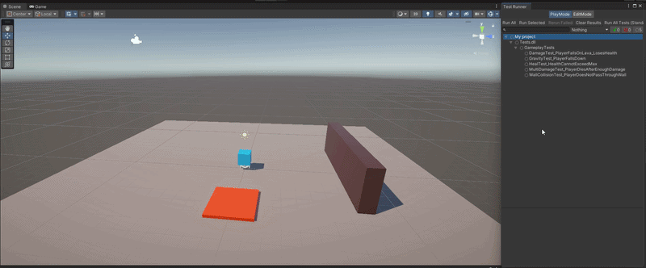

# 🎮 Unity QA Automation Sandbox


[](https://github.com/larelgit/Unity-QA-Automation-Sandbox/actions)

> Automated PlayMode & EditMode testing framework using Unity Test Runner,
> NUnit, and C#. Demonstrates QA Automation principles in game development.

## 📸 Demo




## 🧪 What's Being Tested

### PlayMode Tests (Integration)
| # | Test | What It Does |
|---|------|-------------|
| 1 | **Damage Test** | Player falls on lava → loses 20 HP |
| 2 | **Wall Collision** | Player cannot pass through walls |
| 3 | **Multi Damage** | Player dies after taking 100 total damage |
| 4 | **Gravity** | Rigidbody falls under gravity |
| 5 | **Heal Cap** | Health never exceeds MaxHealth |

### EditMode Tests (Unit)
| # | Test | What It Does |
|---|------|-------------|
| 1 | Full Health on Start | `Health == MaxHealth` on init |
| 2 | TakeDamage Reduces HP | `TakeDamage(25)` → HP = 75 |
| 3 | Negative Damage Ignored | `TakeDamage(-10)` → HP unchanged |
| 4 | HP Never Below Zero | `TakeDamage(999)` → HP = 0 |
| 5 | Death Event Fires | `OnDeath` triggers at 0 HP |
| 6 | Heal Restores HP | `Heal(30)` after damage works |
| 7 | Heal Cannot Exceed Max | Over-heal capped at MaxHealth |
| 8 | Dead Player Can't Take Damage | No damage after death |
| 9 | Dead Player Can't Heal | No healing after death |
| 10 | OnDamageTaken Event Values | Event passes correct HP & damage |

## 🏗️ Architecture

```
Assets/
├── Scripts/          # Game logic (Player, Lava, PlayerMover)
├── Tests/
│   ├── PlayMode/     # Integration tests (real physics)
│   └── EditMode/     # Unit tests (pure logic)
├── Prefabs/          # Reusable game objects
└── Scenes/           # Test scene
```

## 🚀 How to Run

1. Open the project in **Unity 2022.3 LTS**
2. Go to **Window → General → Test Runner**
3. Click **Run All** on both EditMode and PlayMode tabs
4. Watch the magic happen ✨

## 🔄 CI/CD

Tests run automatically on every push via **GitHub Actions**
using [GameCI](https://game.ci/).

## 🛠️ Tech Stack

- **Engine:** Unity 2022.3 LTS
- **Language:** C#
- **Testing:** Unity Test Framework + NUnit
- **CI/CD:** GitHub Actions + GameCI
- **Patterns:** AAA (Arrange-Act-Assert)

## 📝 License

MIT
